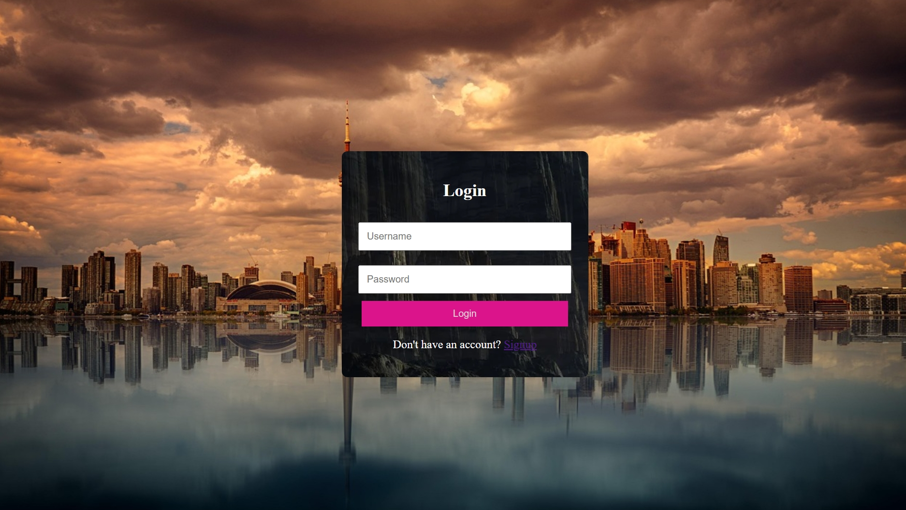
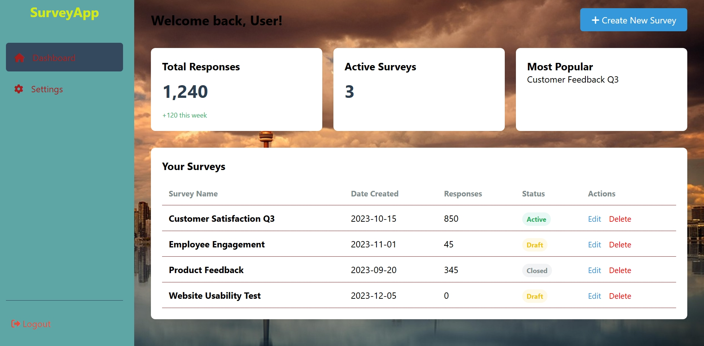

•📊 SurveyApp Frontend Dashboard  

• A responsive, pure frontend web application for managing surveys, user authentication, and profile settings.

•📖 Project Overview 

• This project is a functional frontend prototype designed to simulate a survey management platform. It includes a dynamic dashboard with mock data, a settings panel with image preview capabilities, and a full suite of authentication and landing pages.

• The application is built using  JavaScript, CSS3, and HTML5, relying on simulated data structures instead of a backend database.

🚀 Key Features
1. Interactive Dashboard (dashboard.html / .js) 
Dynamic Data Table: 
Renders a list of surveys (Customer Satisfaction, Employee Engagement, etc.) using a mock database array.

• Smart Status Indicators: Automatically applies color-coded badges (e.g., Active, Draft, Closed) based on survey status.

• Single-Page Navigation:
 Uses JavaScript to switch seamlessly between the "Dashboard" and "Settings" tabs without reloading the page.

• Mock CRUD Actions:
 Buttons for "Edit" and "Delete" trigger alerts and confirmation dialogs to simulate user interaction.

2. User Settings & Personalization 
Logo Upload Preview: 
The settings tab features a FileReader implementation that allows users to upload an image and instantly see a preview in the browser.

• Profile Management:
 UI forms provided for updating email addresses and passwords.

3. Authentication & Landing  (signup.html, welcome about.html)
Styled Forms: Custom CSS ensures login and signup forms are centered, responsive, and aesthetically pleasing.

• Visual Themes: 
Utilizes background images to create an immersive user experience across authentication pages.

• Tabbed Landing Content:
 The "Welcome / About" section uses JavaScript to toggle active page states for smooth content navigation.

📂 File Manifest & Structure 

This project consists of the following uploaded files, organized by module:

🔹 Dashboard Module 

• dashboard.html:
 The core application layout containing the sidebar, header, stats grid, and content area.

• dashboard.css: 
Extensive styling for the dashboard layout (Flexbox/Grid), cards, tables, and sidebar navigation.

• dashboard.js:
 The "brain" of the dashboard. Handles mock data generation, table rendering, tab switching, and button events.

🔹 Authentication Module 

• signup.html: 
The HTML structure for the user registration page.

• signup.css:
 Styling for the signup container, inputs, and buttons, including background image handling.

• login.css: 
Specific styling for the login view, ensuring visual consistency with the signup page.

🔹 Landing & Info Module 

• welcome about.css:
 Styles the navigation bar and content sections for the introductory pages.

• welcome about.js: 
Contains the showPage() function to manage tab visibility on the welcome page.

🔹 Assets (Images) 

• image.jpeg: 
 High-resolution background image (Landscape/Sci-fi style) used for containers.

• image2.jpeg:  
High-resolution background image (Cityscape) used for the body background.

🛠️ Technical Implementation Details 

• Mock Database:
 Data is stored in a const array surveys within dashboard.js, containing ID, name, date, responses, and status.

• DOM Manipulation:
 The application heavily uses document.getElementById and createElement to dynamically build tables and update the UI.

• CSS Architecture:

• Variables & Reset:
 dashboard.css includes a CSS reset and base font styles.

• Layouts: Utilizes display: grid for statistics cards and display: flex for the sidebar layout.

• Interactive States: Includes :hover effects on buttons and navigation items.

💻 How to Run 

• Download all the files listed in the File Manifest above.

• Ensure the images (image.jpeg, image2.jpeg) are in the same directory as the HTML/CSS files to load backgrounds correctly.

• Open dashboard.html in your preferred web browser to view the main application.

• Open signup.html to view the registration flow.

 